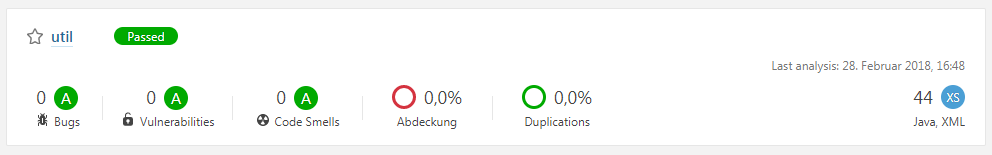
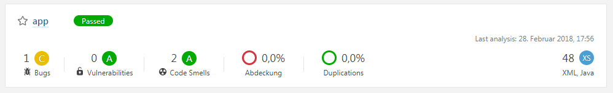
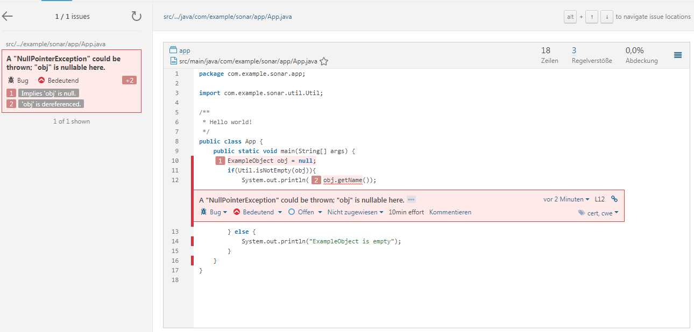

# sonarqube-npe-false-positive
Example Repo to reproduce false positive NPE in Sonarqube

## HOWTO
This repo consists of two branches:
 - master - contains main application
 - util - contains util app which is used by main
 
 To reproduce the issue:
 - checkout the repo
 - switch to util branch
 - run `mvn install sonar:sonar` to install util part in your local maven repository and run sonar analysis (follow [sonarqube docs](https://docs.sonarqube.org/display/SCAN) to setup analysis)
 - it should look like that
 

 - switch to master
 - run `mvn install sonar:sonar` to install app part in your local maven repository and run sonar analysis
 - it should look like that 
 
 
 
 - in Bug view you will see that sonarqube shows a message: *A "NullPointerException" could be thrown; "obj" is nullable here.*
 because it does not know that `Util.isNotEmpty(obj)` checks that already.
 
 
  
 
